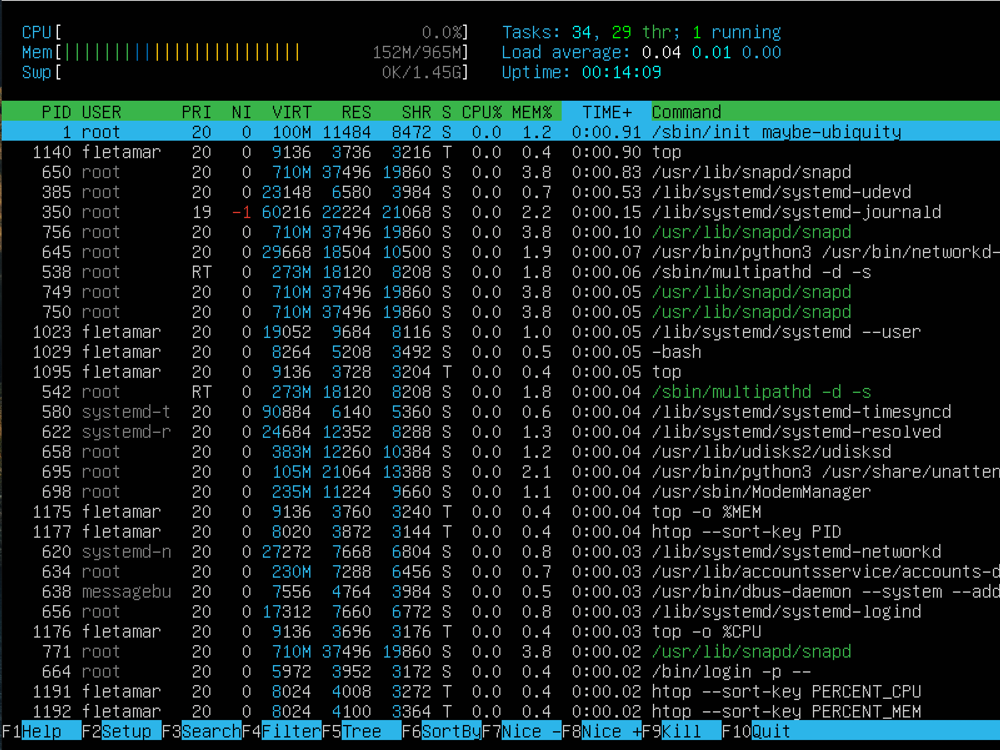
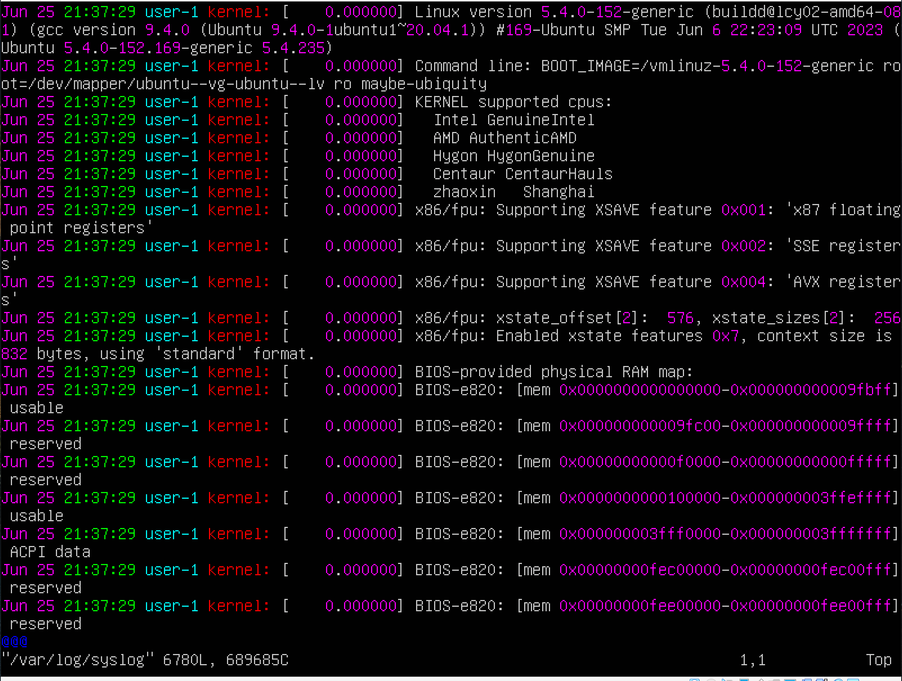

#Report

## Part 1. Installation of the OS
Install Ubuntu 20.04 Server LTS without GUI

`$ cat /etc/issue`

## Part 2. Creating a user
Create a user other than the one created during installation. The user must be added to adm group.

- 2.1 Create a user other than the one created during installation

`$ sudo adduser alex`

- 2.2 The new user must be in the output of the command:

`$ cat /etc/passwd`

- 2.3 The user must be added to adm group.

`$ cat /etc/passwd | grep alex`

CHECK!!!

## Part 3. Setting up the OS network

- 3.1 Set the machine name as user-1

`$ sudo hostnamectl set-hostname user-1`

`$ sudo hostname user-1`

`$ hostnamectl`

- 3.2 Output the names of the network interfaces using a console command

`$ sudo timedatectl set-timezone Europe/Moscow`

`$ timedatectl`

- 3.3 Output the names of the network interfaces using a console command.

`$ ip -br link show`

    In the report give an explanation for the presence of the lo interface.

lo (loopback device) – виртуальный интерфейс, присутствующий по умолчанию в любом Linux. Он используется для отладки сетевых программ и запуска серверных приложений на локальной машине. С этим интерфейсом всегда связан адрес 127.0.0.1. У него есть dns-имя – localhost. Посмотреть привязку можно в файле /etc/hosts.

- 3.4 Use the console command to get the ip address of the device you are working on from the DHCP server.

`$ ip address show`

    Decode DHCP in the report.

DHCP (Dynamic Host Configuration Protocol) is a network management protocol used to dynamically assign an IP address to any device, or node, on a network so it can communicate using IP.

- 3.5 Define and display the external ip address of the gateway (ip) and the internal IP address of the gateway, aka default ip address (gw).

`$ curl curlmyip.ru`

`$ ip route`

- 3.6 Set static (manually set, not received from DHCP server) ip, gw, dns settings (use public DNS servers, e.g. 1.1.1.1 or 8.8.8.8).

Change to static.

`$ sudo vim /etc/netplan/00-installer-config.yaml`

`$ sudo netplan apply` - apply new configuration

- 3.7 Reboot the virtual machine. Make sure that the static network settings (ip, gw, dns) correspond to those set in the previous point.

`$ reboot`

`$ cat /etc/netplan/00-installer-config.yaml`

    Successfully ping 1.1.1.1 and ya.ru remote hosts and add a screenshot of the output command to the report. There should be "0% packet loss" phrase in command output.

`$ ping 1.1.1.1`

`$ ping ya.ru`

## Part 4. OS Update

 Update the system packages to the latest version

 `$ sudo apt-get dist-upgrade`

 
 

## Part 5. Using the sudo command

    Allow user created in Part 2 to execute sudo command.

`$ sudo hostnamectl set-hostname alex`

`$ hostnamectl`

 

 sudo is a program for Unix-like computer operating systems that enables users to run programs with the security privileges of another user, by default the superuser.

 ## Part 6. Installing and configuring the time service

    Set up the automatic time synchronisation service.

`$ sudo timedatectl`

`$ timedatectl show`

## Part 7. Installing and using text editors

## - VIM

`$ sudo apt install vim` - Installing VIM

`$ vim test_vim.txt` - Creating a txt file by VIM

- Esc 
- :wq - Exit with saving
- Enter

- Esc
- :q! - Exit without saving
- Enter

- /'!' - Search for

- s/'Hello again!' - Replacement

## - NANO

`$ sudo apt install nano` - Installing NANO

`$ nano test_nano.txt` - Creating a txt file by NANO

- Ctrl + X - Exit
- Y - Save

- Ctrl + X - Exit
- N - Don't save

For searching press Ctrl+W. 
Word that should be replaced need to write and press Ctrl+R - Enter.
Write replacing word and press Enter.
Press Y for replacement.

## - JOE

`$ sudo apt install joe` - Installing JOE

`$ joe test_joe.txt` - Creating txt file by JOE

- Ctrl+K, Q, Y - Exit with saving

- Ctrl+K, Q, N - Exit without saving

- Ctrl+K, F - Search

- Ctrl+K, F, R, Y - Replacement

## Part 8. Installing and basic setup of the SSHD service

- 8.1 Install the SSHd service

`$ sudo apt-get install ssh`

`$ sudo apt install openssh-server`

- 8.2  Add an auto-start of the service whenever the system boots

`$ sudo systemctl enable ssh`

`$ systemctl status ssh`

- 8.3 Reset the SSHd service to port 2022.

`$ sudo nano /etc/ssh/sshd_config`

- 8.4 Show the presence of the sshd process using the ps command. To do this, you need to match the keys to the command.

`$ ps -auxf | grep ssh`

    Explain in the report the meaning of the command and each key in it.

    ps - report a snapshot of the current processes.

           -a   Select all processes except both session leaders and processes not associated with a terminal.

           -u   Select by effective user ID (EUID) or name.  This selects the processes whose effective user name or ID is in userlist.

           -x   View all processes owned by you

           -f   Do full-format listing.

- 8.5 Reboot the system.

`$ sudo reboot now`

    The output of the netstat -tan command should contain
    tcp 0 0.0.0.0:2022 0.0.0.0:* LISTEN

`$ netstat -tan`

    Explain the meaning of the -tan keys, the value of each output column, the value 0.0.0.0 in the report.

>-t	Showing the current TCP chimney offload state in place of the typically displayed TCP state.

>-a	Displays active TCP connections, TCP connections with the listening state, as well as UDP ports that are being listened to.

>-n	Preventing netstat from attempting to determine host names for foreign IP addresses.

>Proto: Connection protocol

>Recv-Q: Network Receive Queue

>Send-Q: Network Send Queue

>Local Address: IP address of the local computer and the port number used

>Foreign Address: IP address and port number of the remote computer connected to this socket

>State: TCP connection status

> 0.0.0.0 defines an IP block containing all possible IP addresses. It is commonly used in routing to depict the default route as a destination subnet. It matches all addresses in the IPv4 address space and is present on most hosts, directed towards a local router.

# Part 9. Installing and using the top, htop utilities

- 9.1 Install and run the top and htop utilities

`$ sudo apt install htop`

`$ top`

    From the output of the top command determine and write in the report:
>uptime - 4 min;
>number of authorised users - 1;
>total system load - 0.01, 0.04, 0.01;
>total number of processes - 98;
>cpu load - 0.0%;
>memory load - 145.1;
>pid of the process with the highest memory usage - 1;
>pid of the process taking the most CPU time - none;

    Add a screenshot of the htop command output to the report:
>sorted by PID, PERCENT_CPU, PERCENT_MEM, TIME

`$ htop --sort-key PID`

`$ htop --sort-key PERCENT_CPU`

`$ htop --sort-key PERCENT_MEM`

`$ htop --sort-key TIME`

>filtered for sshd process

`$ htop`

- F4

>with the syslog process found by searching

- F3

>with hostname, clock and uptime output added

- F2 CHECK!!!!

## Part 10. Using the fdisk utility

`$ sudo fdisk -l`

    In the report write the name of 
>the hard disk - VBOX HARDDISK
>capacity - 10GiB
>number of sectors - 20971520
>the swap size - CHECK!!!

`$ free -h`

## Part 11. Using the df utility

Run the df command.

`$ df`

    In the report write for the root partition (/):
>partition size - 8408452
>space used - 4201588
>space free - 3758148
>percentage used - 53%
>Determine and write the measurement unit in the report - Kilobyte

Run the df -Th command.

`$ df -Th`

    In the report write for the root partition (/):
>partition size - 8.1G
>space used - 4.1G
>space free - 3.6G
>percentage used - 53%
>Determine and write the file system type for the partition in the report - ext4

## Part 12. Using the du utility

Run the du command.

Output the size of the /home, /var, /var/log folders (in bytes, in human readable format)

`$ sudo du -B1 -d0 /home /var/log /var`

Output the size of all contents in /var/log (not the total, but each nested element using *)

`$ sudo du -h /var/log/*`

## Part 13. Installing and using the ncdu utility

Install the ncdu utility.

`$ sudo apt install ncdu`

Output the size of the /home, /var, /var/log folders.

`$ sudo ncdu /`

## Part 14. Working with system logs

Open for viewing:
1. /var/log/dmesg

`$ sudo vim /var/log/dmesg`

2. /var/log/syslog

`$ sudo vim /var/log/syslog`

3. /var/log/auth.log

`$ sudo vim /var/log/auth.log`

    Write the last successful login time - Jun 26 04:59:22;
>user name - fletamar;
>login method in the report - pam_unix;

    `$ sudo cat /var/log/auth.log | grep login`

    Restart SSHd service.

    `$ sudo systemctl restart sshd`

    `$ cat /var/log/syslog | grep ssh`

## Part 15. Using the CRON job scheduler

Using the job scheduler, run the uptime command in every 2 minutes.

`$ sudo crontab -e`

>Find lines in the system logs (at least two within a given time range) about the execution.

`$ grep -i cron /var/log/syslog`

>Display a list of current jobs for CRON.

`$ sudo crontab -l`

Remove all tasks from the job scheduler.

`$ sudo crontab -r`

`$ sudo crontab -l`

